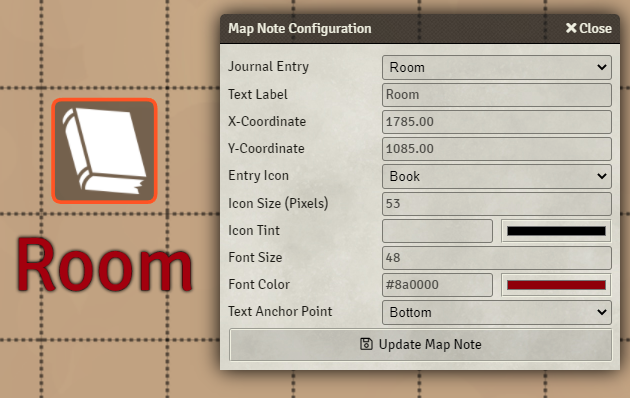

**THIS MODULE IS DEPRECATED AS OF 0.7.5. It has been absorbed into core**

# Note Text Color

A small module which adds a text color field to the map note dialog for FoundryVTT

Due to limitations the initial color of the field is always white. I'll look into fixing this in the future.

If you experience any issues, feel free to ping me on discord (@Erceron#0370) or on reddit (u/Erceron)

## Contribution
If you'd like to support my work, feel free to leave a tip through [my paypal](http://paypal.me/cre463)
